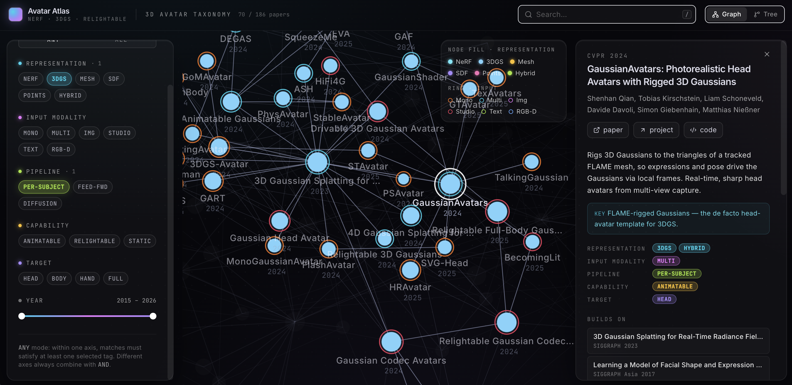
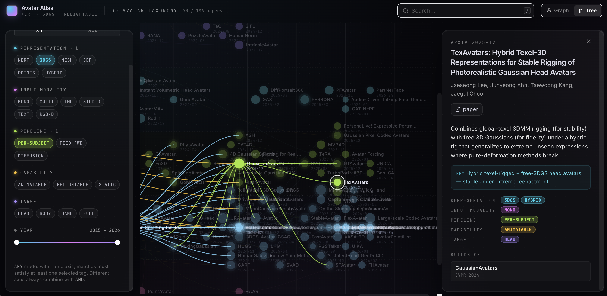

# 3D Avatar Atlas — Taxonomy

Welcome to the **3D Avatar Atlas**, an interactive map of research on 3D human
avatars. The atlas covers NeRF, 3D Gaussian Splatting, mesh-based avatars,
parametric body/face/hand priors, relightable and animatable humans, and the
methods that connect them.

Filter along five axes — representation, input modality, pipeline, capability,
and target — and switch between a force-directed graph and a temporal tree to
see how the field has evolved from 2018 through today.

**Live site:** https://avatar-taxonomy.vercel.app

## Feedback

Found a wrong tag, a missing paper, or a bug? Please open an issue at
[github.com/justin4ai/avatar-taxonomy/issues](https://github.com/justin4ai/avatar-taxonomy/issues)
or email [justinahn@kaist.ac.kr](mailto:justinahn@kaist.ac.kr).
